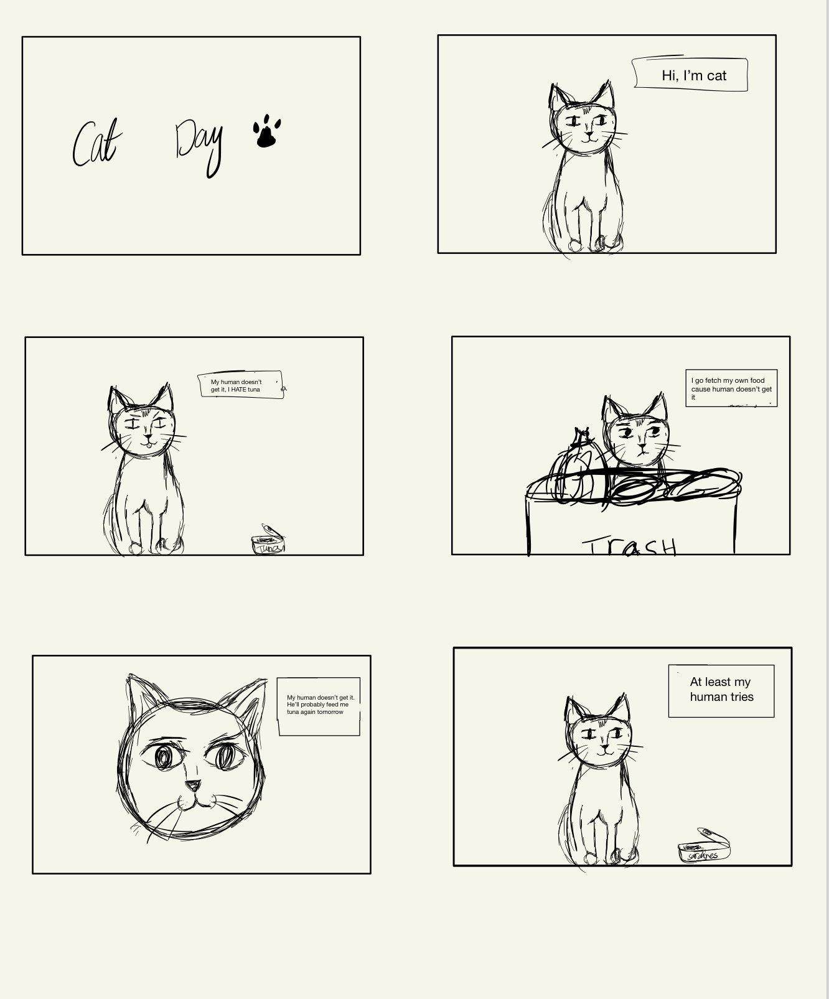
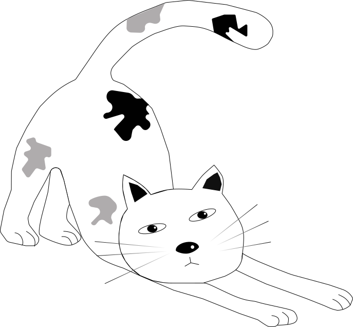

# :cat2: Dinner and a Walk
#### By the wonderful: Juan, Elina, Adina, and Nouf 
## The comic:
#### The comic takes us through a day in Cat's life. We start off in Cat's home where he refuses to eat the food his Human gave him so he goes on a stroll in search of better food and returns home with a lesson he'll never forget.
## The process:
### 🐾 First:
#### - We went through a few rough sketches and scripts of comics before we settled on one revolving around an arrogant cat.
##### This one!

### 🐾 After settling on that story:
#### - We created a wireframe with an even better storyline!

### 🐾 We then started to create the collages we planned to use as backgrounds:
#### - Here are some of them!

### 🐾 Then our Cat came to life:
#### - Here he is thriving

